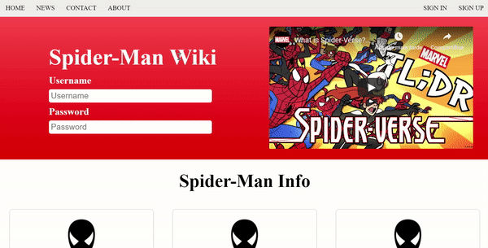

# Spider-Man Wiki
> Simple website using HTML5 and CSS3

The site was made following, not strictly, the course "Beginner Full Stack Web Development" on Udemy.

Pros: DOM manipulation, CSS styling, mobile responsive and debugging principles.

